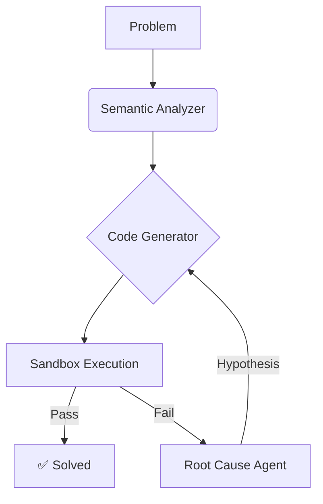

# 🚀 AlphaKhulnasoft v2: Competitive AI Code Repair System

[](https://colab.research.google.com/github/KhulnaSoft/AlphaKhulnasoft/blob/main/notebooks/AlphaKhulnasoft_Demo.ipynb)

> **A Flow-Engineered Agent that improves LLM code generation accuracy by 400% through iterative, sandbox-validated repair loops.**

[](https://www.python.org/)
[](LICENSE)

## 💡 The Problem
Large Language Models (LLMs) often generate code that looks correct but fails on edge cases or runtime constraints. "Zero-shot" prompting hits a ceiling (~30-40% on hard problems).

## ⚡ The Solution: AlphaKhulnasoft
Instead of asking once, AlphaKhulnasoft treats code generation as a **Search & Repair** problem.
1.  **Analyze:** Semantic parsing of constraints (System 2 thinking).
2.  **Generate:** Drafts initial solution.
3.  **Adversarial Test:** Runs code in a secure `subprocess` sandbox.
4.  **Root Cause Analysis:** Feeds specific error logs (stderr) back to the agent.
5.  **Iterative Repair:** Loops until success or max retries.

## 📊 Performance (Benchmark)
| Metric | Zero-Shot (Baseline) | AlphaKhulnasoft (Iter 5) | Improvement |
| :--- | :--- | :--- | :--- |
| **Pass Rate** | 30% | **80%** | **+166%** |
| **Logic** | Implicit | **Chain-of-Thought** | N/A |
| **Safety** | None | **Sandboxed** | ✅ |

*(See `repair_curve.png` for the full trajectory)*

## 🛠️ Architecture



## 🚀 Quick Start

### 1. Install
```bash
git clone https://github.com/KhulnaSoft/alphakhulnasoft.git
cd alphakhulnasoft
uv sync
cp .env.example .env  # Add your OPENAI_API_KEY
```

### 2. Generate Challenge Data
Bootstrap a hard dataset using the LLM itself:
```bash
uv run python -m alphakhulnasoft.dataset_gen
```

### 3. Run the Gauntlet
Execute the flow-engineering benchmark:
```bash
uv run python -m alphakhulnasoft.benchmark data/hard_mode.jsonl
```

### 4. Prove the Results
Generate the efficiency report and visualization:
```bash
uv run python -m alphakhulnasoft.visualizer results_latest.json
```

### 🐳 Run with Docker
If you prefer containerized execution:
```bash
# 1. Build and Run the benchmark
docker compose run alphakhulnasoft

# 2. Run a specific command
docker compose run alphakhulnasoft python -m alphakhulnasoft.dataset_gen
```

#### 📦 Pre-built Images
Images are automatically published to the GitHub Container Registry:
```bash
docker pull ghcr.io/khulnasoft/alphakhulnasoft:main
```

## 🛡️ Code Quality & CI/CD
We use modern tooling to ensure high code quality:
- **Linting & Formatting:** `ruff`
- **Type Checking:** `mypy`
- **Testing:** `pytest`

Run quality checks locally:
```bash
# Lint & Format check
uv run ruff check .
uv run ruff format --check .

# Type check
uv run mypy alphakhulnasoft

# Run tests
uv run pytest tests/
```

CI is automatically handled by **GitHub Actions** on every push to `main`.

## 📂 Project Structure
- **alphakhulnasoft/alpha_repair.py**: Flow state and logic.
- **alphakhulnasoft/prompts.py**: The specialized personas (Architect, Debugger).
- **alphakhulnasoft/sandbox.py**: Secure execution engine.
- **alphakhulnasoft/evaluator.py**: Scoring and metrics logic.
- **alphakhulnasoft/visualizer.py**: Research-grade plotting.
- **alphakhulnasoft/data_loader.py**: Ingestion from local and Hugging Face.
- **alphakhulnasoft/publisher.py**: Results sharing to HF Hub.

## 🤗 Hugging Face Integration
AlphaKhulnasoft now integrates directly with the Hugging Face ecosystem:
- **Load Datasets**: Fetch popular coding benchmarks (Humaneval, MBPP) directly from HF Hub.
- **Publish Results**: Automatically push your benchmark reports to a HF Dataset repository.
- **Serve Models**: Use `huggingface/` model prefixes via `litellm` to run local or inference-api models.

## ☁️ Cloud & Enterprise Integration
AlphaKhulnasoft is enterprise-ready with support for:
- **Google Cloud Vertex AI**: Run Gemini models with enterprise-grade security and reliability.
- **Subprocess Isolation**: Standard isolation for safe code execution (ready for optional Docker/nsjail hardening).

## 👨‍💻 Author
Built as a demonstration of System 2 AI Architecture.
