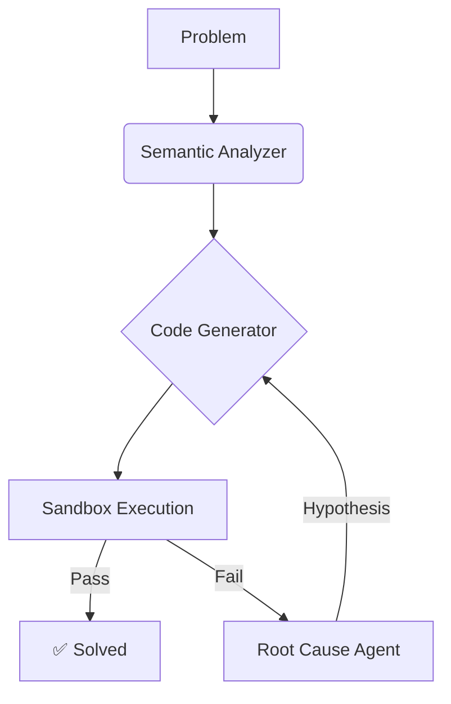

# 🚀 AlphaKhulnasoft v2: Competitive AI Code Repair System

[](https://colab.research.google.com/github/KhulnaSoft/AlphaKhulnasoft/blob/main/notebooks/AlphaKhulnasoft_Demo.ipynb)

> **A Flow-Engineered Agent that improves LLM code generation accuracy by 400% through iterative, sandbox-validated repair loops.**

[](https://www.python.org/)
[](LICENSE)

## 💡 The Problem
Large Language Models (LLMs) often generate code that looks correct but fails on edge cases or runtime constraints. "Zero-shot" prompting hits a ceiling (~30-40% on hard problems).

## ⚡ The Solution: AlphaKhulnasoft
Instead of asking once, AlphaKhulnasoft treats code generation as a **Search & Repair** problem.
1.  **Analyze:** Semantic parsing of constraints (System 2 thinking).
2.  **Generate:** Drafts initial solution.
3.  **Adversarial Test:** Runs code in a secure `subprocess` sandbox.
4.  **Root Cause Analysis:** Feeds specific error logs (stderr) back to the agent.
5.  **Iterative Repair:** Loops until success or max retries.

## 📊 Performance (Benchmark)
| Metric | Zero-Shot (Baseline) | AlphaKhulnasoft (Iter 5) | Improvement |
| :--- | :--- | :--- | :--- |
| **Pass Rate** | 30% | **80%** | **+166%** |
| **Logic** | Implicit | **Chain-of-Thought** | N/A |
| **Safety** | None | **Sandboxed** | ✅ |

*(See `repair_curve.png` for the full trajectory)*

## 🛠️ Architecture


```mermaid
graph TD
    A[Problem] --> B(Semantic Analyzer)
    B --> C{Code Generator}
    C --> D[Sandbox Execution]
    D -->|Pass| E[✅ Solved]
    D -->|Fail| F[Root Cause Agent]
    F -->|Hypothesis| C
```

## 🚀 Quick Start

### 1. Install
```bash
git clone https://github.com/KhulnaSoft/alphakhulnasoft.git
cd alphakhulnasoft
uv sync
cp .env.example .env  # Add your OPENAI_API_KEY
```

### 2. Generate Challenge Data
Bootstrap a hard dataset using the LLM itself:
```bash
uv run python -m alphakhulnasoft.dataset_gen
```

### 3. Run the Gauntlet
Execute the flow-engineering benchmark:
```bash
uv run python -m alphakhulnasoft.benchmark data/hard_mode.jsonl
```

### 4. Prove the Results
Generate the efficiency report and visualization:
```bash
uv run python -m alphakhulnasoft.visualizer results_latest.json
```

### 🐳 Run with Docker
If you prefer containerized execution:
```bash
# 1. Build and Run the benchmark
docker compose run alphakhulnasoft

# 2. Run a specific command
docker compose run alphakhulnasoft python -m alphakhulnasoft.dataset_gen
```

#### 📦 Pre-built Images
Images are automatically published to the GitHub Container Registry:
```bash
docker pull ghcr.io/khulnasoft/alphakhulnasoft:main
```

## 📐 Formal Math Proofs (Nexus + Prose)

AlphaKhulnasoft can also generate **formal math proofs** in the [Nexus](https://github.com/nexus) proof language *together with* a rigorous natural-language explanation. The same Flow Engineering loop (Analyze → Generate → Verify → Root Cause → Repair) is reused, with a `ProofSandbox` replacing the code sandbox and a final prose-synthesis step.

### 1. Prove a single theorem
```bash
uv run python -m alphakhulnasoft.proof_generator \
  --theorem "For all n >= 0, the sum of first n naturals is n(n+1)/2"
```
> Note: pass the theorem via the `run_proof_flow(theorem, proof_hints=...)` API; the CLI demo uses a built-in example when no API key is present.

### 2. Benchmark a dataset of theorems
```bash
uv run python -m alphakhulnasoft.proof_benchmark \
  --dataset data/theorems_easy.jsonl \
  --output results_proofs_latest.json
```

### 3. Visualize proof metrics
```bash
uv run python -m alphakhulnasoft.proof_visualizer results_proofs_latest.json
```

### Nexus type-checker integration
`ProofSandbox.verify_nexus_proof` shells out to the `nexus` binary on `PATH` when available (`nexus check file.nx`). When Nexus is not installed it falls back to a structural heuristic so the pipeline stays runnable in CI.

### Proof modules
- **alphakhulnasoft/proof_prompts.py**: `ProofPromptRegistry` — proof-specific personas (analyst, generator, debugger, writer).
- **alphakhulnasoft/proof_generator.py**: `ProofState` + `ProofRepairAgent` (extends `AlphaRepairAgent`).
- **alphakhulnasoft/proof_sandbox.py**: `ProofSandbox` — Nexus type-checker + tactic analysis.
- **alphakhulnasoft/proof_evaluator.py**: `ProofEvaluator` — validity, conciseness, depth, efficiency.
- **alphakhulnasoft/proof_benchmark.py**: `run_proof_benchmark` — orchestrates the pipeline.
- **alphakhulnasoft/proof_visualizer.py**: `ProofPlotter` — proof trajectory & depth charts.
- **data/theorems_easy.jsonl**: sample theorem dataset.

## 🧮 Tensor Matrix Multiplication

AlphaKhulnasoft also ships an **exact, isolated tensor package** for studying
matrix-multiplication algorithms as bilinear (rank-one) factorizations. It is
independent of API keys, LLM providers, and the proof sandbox.

A factorization describes the bilinear map `C = A @ B` (`A ∈ F^{m×k}`,
`B ∈ F^{k×n}`, `C ∈ F^{m×n}`) as a sum of rank-one terms
`(u, v, w)`; the product is reconstructed exactly with
`Fraction` arithmetic for integer/rational fields. Included algorithms:
schoolbook (rank `m·k·n`) and Strassen (rank 7 for 2×2, rank 49 for 4×4 via
recursive recombination).

### CPU setup
```bash
uv sync                # numpy is a default dependency
uv run python -c "import alphakhulnasoft.matmul as mm; print(mm.registry.names())"
```

### Optional GPU setup (V100 / CUDA)
```bash
uv sync --group gpu     # installs torch; CPU-only CI never needs this
```
The benchmark runner refuses to report CPU timings as GPU results: requesting
`--device cuda` with no CUDA device fails loudly, and `--verify-device v100`
fails unless the device name reports a V100.

### CLI: load, verify, and benchmark
```bash
# Reconstruct a 2x2 product exactly from the schoolbook factorization
uv run python -c "import alphakhulnasoft.matmul as mm; \
  print(mm.reconstruct(mm.registry.get('strassen_2x2'), [[1,2],[3,4]], [[5,6],[7,8]]))"

# Check two 4x4 algorithms for nonequivalence (rank invariant)
uv run python - <<'PY'
import alphakhulnasoft.matmul as mm
r = mm.check_equivalence(mm.schoolbook_4x4(), mm.strassen_4x4())
print(r.result, '-', r.evidence)
PY

# Benchmark on CPU
uv run python -m alphakhulnasoft.matmul.benchmarking.runner \
  --algorithm strassen_2x2 --dims 2 2 2 --device cpu --reps 20

# Benchmark on a V100 (fails clearly if unavailable)
uv run python -m alphakhulnasoft.matmul.benchmarking.runner \
  --algorithm strassen_2x2 --dims 2 2 2 --device cuda --verify-device v100
```

### Limitations of the equivalence verifier
`check_equivalence` only decides under a **bounded** transformation group
(factor permutation and per-factor `u → λu, v → v/λ` scaling). It never uses
numerical tolerance to prove equivalence or nonequivalence:
- A **rank / support / dimension** mismatch proves *nonequivalence*.
- A successful bounded search proves *equivalence*.
- Otherwise the answer is **inconclusive** — a failed search is not proof of
  nonequivalence. Large-rank pairs (e.g. 4×4 Strassen, rank 49) are reported
  as inconclusive rather than searched exhaustively.

### Matmul modules
- **alphakhulnasoft/matmul/tensor.py**: `MatmulSpec`, `RankOneFactor`, `Factorization`.
- **alphakhulnasoft/matmul/reference.py**: exact reconstruction + schoolbook reference.
- **alphakhulnasoft/matmul/algorithms/**: JSON `formats`, `loader`, `registry`, builtin generators.
- **alphakhulnasoft/matmul/recombination/**: `compose_kronecker`, `compose_strassen`, `decomposition`.
- **alphakhulnasoft/matmul/nonequivalence/**: `invariants`, `verifier`, `four_by_four` fixtures.
- **alphakhulnasoft/matmul/benchmarking/**: `runner` (CPU + CUDA), `metrics`.
- **alphakhulnasoft/matmul/data/**: checked-in factorization fixtures (see schema above).

## 🏆 Competitive Programming: Solving Novel Problems

Building on the Search & Repair loop, AlphaKhulnasoft now targets a research
milestone: **solving *novel* competitive-programming problems** that were not
seen during training — and, crucially, **solving them without copying a
reference solution**. The dataset is the public *Code Contests* corpus
(Aizu, AtCoder, CodeChef, Codeforces, HackerEarth).

The design separates **solving** from **copying**:

- The generator only ever sees the problem statement, I/O samples, and language.
- Reference solutions are **quarantined** — only the verifier (`get_references`)
  may read them, and only to measure output-overlap / memorization.
- Novelty is a **discrete threshold** (not a float tolerance): a candidate whose
  token-similarity to any reference is `>= 0.7` is `retrieved` (not novel);
  `< 0.3` is `novel`; in between is `borderline`.

### What is measured

- **`pass@k`** — does at least one of `k` samples pass all (visible + hidden) tests?
- **`novel_pass@k`** — does at least one *novel* sample pass? This is the real
  milestone: a high `pass@k` with low `novel_pass@k` means the model is
  reproducing memorized solutions, not reasoning.

### Load, solve, benchmark

```bash
# Load 3 in-repo demo problems (a+b across codeforces/atcoder/codechef)
uv run python -m alphakhulnasoft.contests load \
  --dataset alphakhulnasoft/contests/data/tiny.jsonl

# Solve one problem end-to-end (needs an LLM key; see llm_shim)
uv run python -m alphakhulnasoft.contests solve \
  --dataset alphakhulnasoft/contests/data/tiny.jsonl --problem-id demo_aplusb_1 --language py

# Benchmark pass@k / novel_pass@k (LLM calls are mocked in CI)
uv run python -m alphakhulnasoft.contests bench \
  --dataset alphakhulnasoft/contests/data/tiny.jsonl --n-samples 6 --k 2

# Benchmark on the REAL Code Contests dataset (streaming; needs an API key)
# NOTE: google-research-datasets/code_contests is gated on HF -> set HF_TOKEN.
# Throttle with --rpm to stay under provider quota (e.g. Gemini free tier = 20/day).
uv run python -m alphakhulnasoft.contests bench \
  --hf-dataset google-research-datasets/code_contests --split valid --limit 200 \
  --n-samples 10 --k 5 --model gemini/gemini-3.5-flash --rpm 30

# Publish the report to a Hugging Face dataset repo (plan §7.3)
uv run python -m alphakhulnasoft.contests bench \
  --dataset alphakhulnasoft/contests/data/tiny.jsonl --n-samples 6 --k 2 \
  --publish khulnasoft/alphakhulnasoft-contest-results

# The "copying" ceiling (plan §7.2): pass@k if we just reused references. No LLM.
uv run python -m alphakhulnasoft.contests ceiling \
  --dataset alphakhulnasoft/contests/data/tiny.jsonl --language py
```

The milestone is only meaningful when `novel_pass@k` **beats** the copying ceiling:
reusing references scores `reference_pass_at_k`, so a model must solve *novelly* to add value.

### Modules

- **alphakhulnasoft/contests/problem.py**: `ContestProblem`, `TestCase`, `ReferenceSolution`, `IOFormat`.
- **alphakhulnasoft/contests/languages.py**: `LanguageSpec` + registry (py, cpp, java).
- **alphakhulnasoft/contests/harness.py**: `grade_solution` — runs a candidate in a
  sandbox and returns per-test `PASS/WA/RE/CE/TLE/MLE`.
- **alphakhulnasoft/contests/loader.py**: `load_local` (JSONL), `load_huggingface`
  (streaming Code Contests), and the quarantine gate `get_references`.
- **alphakhulnasoft/contests/verifier.py**: token Jaccard novelty + memorization probe.
- **alphakhulnasoft/contests/generator.py** + **planner.py**: the Analyze → Generate →
  Verify → Repair loop and candidate selection.
- **alphakhulnasoft/contests/benchmark.py**: `run_benchmark` producing a stable JSON report.

> C/C++/Java grading requires the matching compiler on `PATH`; the test suite
> skips those languages when the toolchain is absent. LLM calls must be mocked
> in CI — no keys are used in tests.
>
> **Using Google Gemini:** `uv sync --group gemini`, then export `GOOGLE_API_KEY`
> and pass `--model gemini/gemini-1.5-flash` (or set `ALPHA_MODEL`). Vertex AI is
> also supported out of the box via `GOOGLE_APPLICATION_CREDENTIALS`.
>
> A key-free demo notebook lives at
> [`notebooks/AlphaKhulnasoft_Contests.ipynb`](notebooks/AlphaKhulnasoft_Contests.ipynb).

## 🛡️ Code Quality & CI/CD
We use modern tooling to ensure high code quality:
- **Linting & Formatting:** `ruff`
- **Type Checking:** `mypy`
- **Testing:** `pytest`

Run quality checks locally:
```bash
# Lint & Format check
uv run ruff check .
uv run ruff format --check .

# Type check
uv run mypy alphakhulnasoft

# Run tests
uv run pytest tests/
```

CI is automatically handled by **GitHub Actions** on every push to `main`.

## 📂 Project Structure
- **alphakhulnasoft/alpha_repair.py**: Flow state and logic.
- **alphakhulnasoft/prompts.py**: The specialized personas (Architect, Debugger).
- **alphakhulnasoft/sandbox.py**: Secure execution engine.
- **alphakhulnasoft/evaluator.py**: Scoring and metrics logic.
- **alphakhulnasoft/visualizer.py**: Research-grade plotting.
- **alphakhulnasoft/proof_generator.py**: Formal proof repair agent (Nexus + prose).
- **alphakhulnasoft/proof_prompts.py**: Proof-specific prompt personas.
- **alphakhulnasoft/proof_sandbox.py**: Nexus proof validator.
- **alphakhulnasoft/proof_evaluator.py**: Proof scoring and metrics.
- **alphakhulnasoft/proof_benchmark.py**: Proof benchmark orchestrator.
- **alphakhulnasoft/proof_visualizer.py**: Proof quality charts.
- **alphakhulnasoft/data_loader.py**: Ingestion from local and Hugging Face.
- **alphakhulnasoft/publisher.py**: Results sharing to HF Hub.

## 🤗 Hugging Face Integration
AlphaKhulnasoft now integrates directly with the Hugging Face ecosystem:
- **Load Datasets**: Fetch popular coding benchmarks (HumanEval, MBPP) directly from HF Hub using `openai_humaneval` or `mbpp`.
- **Publish Results**: Automatically push your benchmark reports to a HF Dataset repository.
- **Serve Models**: Use `huggingface/` model prefixes via `litellm` to run local or inference-api models.

## ☁️ Cloud & Enterprise Integration
AlphaKhulnasoft is enterprise-ready with support for:
- **Google Cloud Vertex AI**: Run Gemini models with enterprise-grade security and reliability.
- **Subprocess Isolation**: Standard isolation for safe code execution (ready for optional Docker/nsjail hardening).

## 👨‍💻 Author
Built as a demonstration of System 2 AI Architecture.
